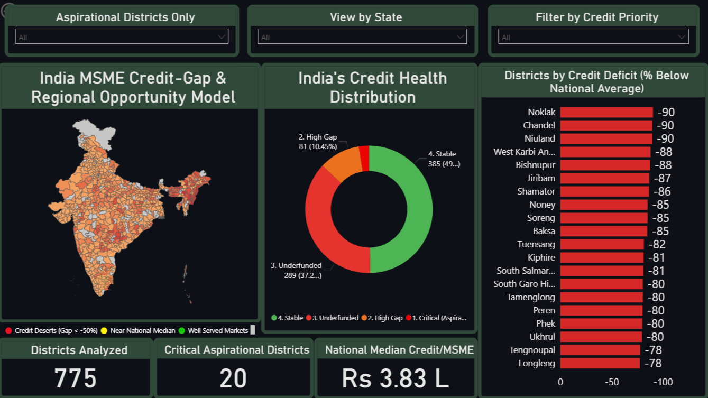
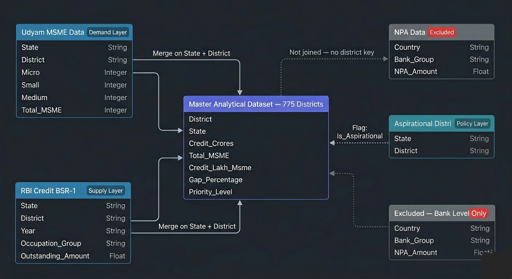

# India MSME Credit-Gap & Regional Opportunity Model

**Identifying India's Credit Deserts — A District-Level Lending Intelligence Model for Strategic Bank Expansion**

---

## Table of Contents
1. [Project Background](#project-background)
2. [Data Structure & Initial Checks](#data-structure--initial-checks)
3. [Executive Summary](#executive-summary)
4. [Insights Deep Dive](#insights-deep-dive)
5. [Recommendations](#recommendations)
6. [Assumptions & Caveats](#assumptions--caveats)
7. [Technical Stack](#technical-stack)
8. [Data Sources](#data-sources)

---
## Project Background

Apex Commercial Bank is a mid-sized scheduled commercial bank operating across 18 Indian states, with a growing focus on Priority Sector Lending (PSL) compliance and MSME portfolio expansion. The bank's strategy team has identified rural and semi-urban MSME lending as a key growth vertical for FY 2025-26, but lacks a data-driven framework for identifying which districts represent genuine opportunity versus high-risk or already-saturated markets.

This project constructs a district-level credit intelligence model by merging RBI banking disbursement data with Udyam MSME registration records across 775 Indian districts. The goal is to identify **Credit Deserts** — districts where business formation is high but formal bank credit is critically low and rank them by expansion priority, factoring in government policy designations from NITI Aayog's Aspirational Districts Programme.

Insights and recommendations are provided on the following key areas:

- **Credit Supply-Demand Gap:** Where is the mismatch between registered MSME density and actual formal credit reaching businesses?
- **Geographic Concentration:** Which states and regions is the formal banking sector systematically leaving behind?
- **Policy Alignment:** Which underserved districts also carry government priority status, creating a low-risk, high-reward expansion case?
- **Market Segmentation:** How can India's 775 districts be classified into actionable strategic tiers for the bank's expansion team?

The Python notebook used for all data cleaning, merging, and metric engineering is [here](notebooks/MSME_Analysis_Code_NB.ipynb).

The final master dataset (775 districts) used for this analysis is [here](data/Indian_MSME_Credit_Gap_2026.csv).

The interactive Power BI dashboard is [here](dashboard/MSME_Analysis_Dashboard.pbix).

---

## Data Structure & Initial Checks

The analysis draws on four government datasets, with the RBI BSR-1 credit file forming the primary supply-side input:

| Dataset | Source | Size | Key Fields Used |
|---|---|---|---|
| **District-Wise MSME Registrations (Udyam)** | Ministry of MSME / NDAP | 779 rows | State, District, Total Enterprises |
| **District-Wise Bank Credit — SCBs (BSR-1)** | Reserve Bank of India | 426 MB / 2.8M rows | State, District, Occupation Group, Outstanding Amount |
| **Aspirational Districts** | NITI Aayog | 117 rows | State, District |
| **Non-Performing Assets** | RBI Time Series | Bank-level only | Excluded — no district key |

The diagram below shows how each dataset connects to form the Master Analytical Dataset of 775 districts:

Before merging, the following data quality decisions were made:

- **Year standardisation:** RBI file spans FY 2010–2025. Only FY 2024-25 was retained to align with Udyam's till-date 2026 registration figures
- **Occupation group filter:** Agricultural credit was excluded as RBI tracks it under a separate PSL sub-mandate, and inclusion would inflate apparent credit availability in rural districts
- **Unknown district removal:** 10 placeholder rows labelled "Unknown Districts of India" were identified and dropped before the final merge
- **NPA exclusion:** Published at the bank level only, as a district-level risk overlay was methodologically infeasible

---

## Executive Summary

### Overview of Findings

Formal MSME credit in India is structurally concentrated in metro districts, leaving nearly half the country operating below the national median. The national median credit per MSME unit is **₹3.83 Lakhs** against a mean of ₹8.41 Lakhs. With 27 districts receiving more than 75% less credit per MSME than the national benchmark. Geographically, the crisis is concentrated in Northeast and Central India, with Assam (19), Manipur (13), and Nagaland (12) accounting for the highest number of high-gap districts. For Apex Commercial Bank, 101 districts across Tiers 1 and 2 are home to 17 lakh registered MSMEs, representing an immediate, data-backed expansion opportunity.

*Below is the overview page from the Power BI dashboard. The full interactive dashboard can be downloaded [here](dashboard/MSME_Analysis_Dashboard.pbix).*

---

## Insights Deep Dive

### Credit Concentration: National Averages Are Misleading

- The national mean credit per MSME (₹8.41 Lakhs) overstates typical availability by 2.2x relative to the median (₹3.83 Lakhs), driven entirely by outlier metro districts like Mumbai, New Delhi, and Gurugram receiving 1,000% to 10,000%+ above the median.
- 380 districts sit above the national median, but the majority of these are small, low-density markets where limited MSME activity is adequately served, not districts where credit is genuinely abundant.
- Decisions built on national mean figures will systematically underestimate underservice in non-metro markets. The ₹3.83L median is the only accurate benchmark for evaluating whether a district is adequately served.

### Geographic Pattern: Northeast and Central India Are Systematically Left Behind

- The 10 most credit-deficient districts are concentrated in Manipur, Nagaland, and Assam, carrying registered MSME populations of 1,400 to 20,000 units but receiving as little as ₹0.38L per unit against a national median of ₹3.83L.
- Chandel district, Manipur, has 2,097 registered MSMEs, ₹0.40L credit per unit, and receives one-tenth of what the median Indian district receives. This is a banking infrastructure gap, not a demand gap.
- 27 districts receive more than 75% less than the national median. 78 districts fall between 50-75% below. Combined, these 105 districts represent the most acute credit deficit zones in the country.

### Aspirational District Overlay: Where Policy and Opportunity Intersect

- Of 117 Aspirational Districts in the dataset, 20 fall into the Critical tier, receiving more than 50% below the national median despite active NITI Aayog priority designation.
- These 20 districts carry PSL classification benefits, reduced regulatory friction, and active government coordination infrastructure, like lowering the effective cost of market entry for a bank compared to equivalent expansion in non-designated underserved districts.
- 17% of all Aspirational Districts are in critical credit deficit, meaning government-flagged development zones are simultaneously the country's most underbanked MSME markets.

### Market Segmentation: 4-Tier Strategic Classification

- **Tier 1 — Critical Aspirational Desert (20 districts):** Severe credit gap + government priority designation. Highest expansion ROI with PSL tailwinds.
- **Tier 2 — High Gap (81 districts):** More than 50% below median. Strong organic demand, limited formal competition.
- **Tier 3 — Underfunded (289 districts):** Below median, moderate gap. Longer-term pipeline opportunity.
- **Tier 4 — Stable (385 districts):** At or above median. Adequately served or low-density markets with limited incremental opportunity.

The 101 districts in Tiers 1 and 2 are home to **17,01,890 registered MSMEs** and carry a combined **₹26,368 Crores** in current formal credit — significantly below their latent demand given per-unit figures ranging from ₹0.38L to ₹1.9L against a ₹3.83L median.
---

## Recommendations
  
Based on the credit gap analysis and district-level segmentation above, the following actions are recommended for Apex Commercial Bank's MSME strategy and branch expansion team:

 - **Begin branch feasibility assessments in the 20 Critical Aspirational Districts immediately.** These districts combine documented MSME demand, government priority designation, and near-zero formal credit competition. The PSL regulatory framework in Aspirational Districts reduces compliance burden and opens access to credit guarantee schemes that are not available in non-designated markets. Priority states for the first wave: Manipur, Nagaland, Assam, Chhattisgarh, and Sikkim.

 - **Build a 12-month expansion pipeline from the 81 High Gap districts.** These markets show organic credit demand, not policy-induced activity, making them commercially stable expansion targets once the Aspirational District wave is underway. Combined with Tier 1, this gives the bank's strategy team a 101-district expansion roadmap with clear prioritization logic.

 - **Redesign MSME credit products for sub-₹5L ticket sizes.** Credit-per-unit figures in high-gap districts range from ₹0.40L to ₹1.5L, suggesting that existing products designed for higher ticket sizes are structurally misaligned with actual demand in these markets. A microenterprise lending product in the ₹1L–₹5L range would capture the largest unmet demand segment identified in this analysis and strengthen PSL compliance simultaneously.

 - **Replace national mean benchmarks with district-level median analysis in strategy reporting.** The ₹8.41L national mean overstates typical credit availability by 2.2x relative to the median. Internal strategy decks and market sizing models built on the mean will consistently underestimate the scale of underservice in Tier 2 and Tier 3 cities, leading to conservative expansion decisions in markets that warrant aggressive entry.

---

## Assumptions & Caveats

Throughout the analysis, multiple assumptions were made to manage challenges with the data. These assumptions and caveats are noted below:

 - **Occupation group classification:** Four RBI occupation groups were included as MSME credit proxies — Industry, Trade, Transport Operators, and Professional and Other Services. Agricultural credit was excluded as it is tracked under a separate PSL sub-mandate. This decision may slightly understate formal credit availability in districts with significant agro-processing MSME activity.

 - **NPA data exclusion:** RBI publishes Non-Performing Asset data at the bank and institution level, not at the district level. This model does not account for default risk by geography. Districts flagged as high-opportunity may carry elevated credit risk that is not visible in this analysis. Any expansion decision should incorporate the bank's internal risk assessment alongside these opportunity rankings.

 - **District name standardisation:** Government datasets use inconsistent naming conventions across files, reflecting administrative reorganisations over time. Post-2019 bifurcation districts, notably Ladakh, are absent from the map boundary file used in the Power BI dashboard. The analysis covers 775 of approximately 780 to 800 districts, depending on the administrative classification used.

 - **Credit data reporting lag:** RBI's BSR-1 data is state-reported and subject to submission timelines. FY 2024-25 figures may not fully reflect credit disbursed in Q4 of the fiscal year. Supply-side numbers should be treated as directionally accurate rather than precise to the last reporting period.

 - **Informal lending exclusion:** This model captures only formal scheduled commercial bank credit. Informal lending through moneylenders, chit funds, and family networks, which can be substantial in rural and semi-urban districts, is entirely excluded. Actual capital availability in some Credit Desert districts may be higher than formal data suggests.

 - **Udyam registration as demand proxy:** Registered MSME counts are used as a proxy for credit demand. Registration rates vary significantly by state due to differences in awareness campaigns and administrative capacity, which may introduce geographic bias into the demand-side figures for certain states.

---

## Technical Stack

| Tool | Purpose |
|---|---|
| Python | Data cleaning, merging, feature engineering |
| Google Colab | Processing environment for 426MB file on resource-constrained hardware |
| Power BI | Interactive geospatial dashboard and segmentation visualization |
| Git and GitHub | Version control and portfolio hosting |

---

## Data Sources

| Dataset | Publisher | Access |
|---|---|---|
| District-Wise Bank Credit of SCBs (BSR-1) | Reserve Bank of India | [ndap.niti.gov.in](https://ndap.niti.gov.in/dataset/7533) |
| District-Wise MSME Registrations (Udyam) | Ministry of MSME / NDAP | [ndap.niti.gov.in](https://ndap.niti.gov.in/dataset/7723) |
| Aspirational Districts List | NITI Aayog | [niti.gov.in](https://ndap.niti.gov.in/dataset/7795) |

*Raw data files are not hosted in this repository due to file size constraints (RBI BSR-1 file: 426MB). All datasets are publicly available at the links above.*
